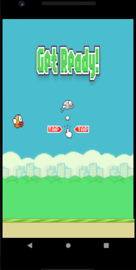

# Flappy bird 
Developing the famous FlappyBird game for Android with the libgdx library

## Screenshots

#### Main Menu

  

#### Game Ready

#### Game Running

#### Game Over

#### Game HighScores

## Author

|  |
| ----------------------------- |
| 
 <a href="https://github.com/kaio-giovanni"> @kaio-giovanni </a> 
|

